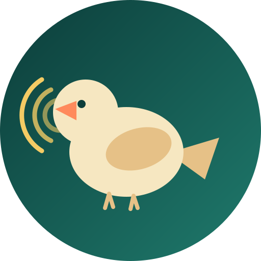

<div align="center"></div>

# Sochi Birds

Real-time bird sound identification for Sochi and the Black Sea coast, running entirely in your browser. A personal fork of [BirdNET Live](https://github.com/birdnet-team/real-time-pwa) (Cornell / Chemnitz, MIT licensed) — no server, no audio upload, works offline once loaded.

On top of the upstream app, this fork adds three tweaks aimed at one fixed region instead of general-purpose global use:

*   **Per-species threshold override** — each detection card has its own +/− to raise or lower the confidence bar for that one species, persisted locally. Consumer bird-ID apps expose only a single global threshold, even though published evaluations show the right threshold varies a lot per species.
*   **Rarity guard** — when geolocation is on, the confidence bar is automatically raised for species the geo/season model considers uncommon on this coast, to cut down on "rare species detected in the wrong place" false positives. A manual per-species override always takes precedence over this (the geo model can be wrong for undersampled areas).
*   **Session history** — a running, timestamped log of what's been heard this session (with a per-species cooldown so one singing bird doesn't flood the log). Stock BirdNET/Merlin only ever show the current moment.

Everything else — offline TFJS inference, spectrogram view, geolocation species filter, temporal pooling — is the upstream BirdNET Live app, unmodified.

## Why frame this as urban research, not just a birding app

Sochi is a narrow subtropical strip between the sea and the Caucasus foothills, under some of the fastest resort/residential construction pressure in Russia. Birdsong is a cheap, continuous, passive signal of ecological health — closer to a noise map or heat map than a birdwatching checklist. The angle (borrowing from R. Murray Schafer's soundscape ecology and from bioacoustic conservation monitoring) is to log *where and when* species are heard, not just identify them once — enough points over time could show which green corridors still connect and which courtyards/parks function as real habitat versus decorative landscaping, as construction density shifts along the coast. See the [About page](src/about.njk) for the full writeup. This is a hobby project, not a peer-reviewed study.

## Roadmap: a shared map

Right now detections stay on-device. The next step under consideration is a shared map — confirmed detections pinned at your location, building a community "who's singing where" layer over time. Likely path: a **Telegram Mini App** (this same web app, opened inside Telegram — detection code unchanged), since Telegram already identifies the user with a signed payload and sharing a location pin is one tap, no separate login. The missing piece is a small shared backend to store/serve the pins.

Key features:
*   **Run offline**: All processing happens locally on your device using TensorFlow.js. No audio data is ever uploaded to a server (models and assets are downloaded once and stored locally).
*   **Real-Time Identification**: Visualizes sound via a spectrogram and provides instant species predictions.
*   **Location-Aware**: Uses your device's geolocation (optional) to filter predictions for species likely to be found in your area.
*   **Offline Capable**: Once loaded, the app works without an internet connection.
*   **Cross-Platform**: Runs on desktop and mobile browsers (Chrome, Safari, Firefox, Edge).

⚠️ **Note**: This project is still in active development. Features and performance may vary across devices and browsers.

## Usage

Live version: [https://vponomarev-tech.github.io/sochi-birds-ai/](https://vponomarev-tech.github.io/sochi-birds-ai/)

To install the PWA on your device, open the site in a compatible browser (e.g., Chrome, Edge, Firefox) and follow the prompts to add it to your home screen or desktop (choose "Install App" when prompted).

## Setup

1. Clone the repository:
   ```bash
   git clone https://github.com/vponomarev-tech/sochi-birds-ai.git
   cd sochi-birds-ai
   ```

2. Build and run the site locally:
   ```bash
   npm install
   npm run serve
   ```
3. Open your browser and navigate to `http://localhost:8080` to view the site.

## License

- **Source Code**: The source code for this project is licensed under the [MIT License](https://opensource.org/licenses/MIT).
- **Models**: The models used in this project are licensed under the [Creative Commons Attribution-ShareAlike 4.0 International License (CC BY-SA 4.0)](https://creativecommons.org/licenses/by-sa/4.0/).

Please ensure you review and adhere to the specific license terms provided with each model.

## Citation

Feel free to use BirdNET for your acoustic analyses and research. If you do, please cite as:

```bibtex
@article{kahl2021birdnet,
  title={BirdNET: A deep learning solution for avian diversity monitoring},
  author={Kahl, Stefan and Wood, Connor M and Eibl, Maximilian and Klinck, Holger},
  journal={Ecological Informatics},
  volume={61},
  pages={101236},
  year={2021},
  publisher={Elsevier}
}
```

## Funding

Our work in the K. Lisa Yang Center for Conservation Bioacoustics is made possible by the generosity of K. Lisa Yang to advance innovative conservation technologies to inspire and inform the conservation of wildlife and habitats.

The development of BirdNET is supported by the German Federal Ministry of Research, Technology and Space (FKZ 01|S22072), the German Federal Ministry for the Environment, Climate Action, Nature Conservation and Nuclear Safety (FKZ 67KI31040E), the German Federal Ministry of Economic Affairs and Energy (FKZ 16KN095550), the Deutsche Bundesstiftung Umwelt (project 39263/01) and the European Social Fund.

## Partners

BirdNET is a joint effort of partners from academia and industry.
Without these partnerships, this project would not have been possible.
Thank you!


